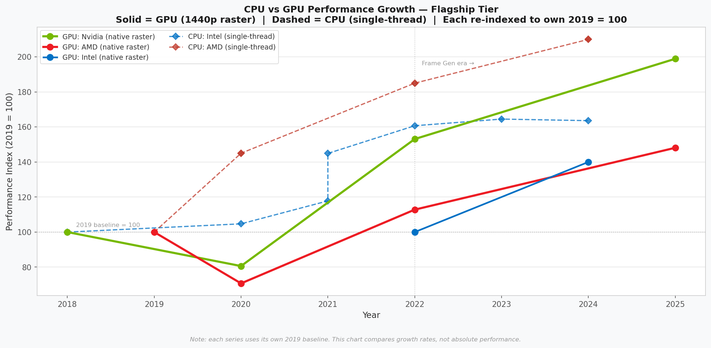

# The Upscaling Illusion
### Did AI features replace raw GPU performance or just justify higher prices?

> An end to end data analysis project examining whether DLSS, FSR, and XeSS genuinely delivered better value per dollar across GPU generations, or whether manufacturers used AI upscaling as cover to slow raw hardware progress while raising prices.

> 🔗 [**Open Interactive Dashboard**](https://lalitsh03.github.io/upscaling-illusion/looker/dashboard.html)

---

## The Question

GPU manufacturers have spent the last three generations marketing AI upscaling as a revolution. DLSS 3, FSR 3, and XeSS all promise dramatically better performance with no extra silicon.

But strip out the AI-generated frames and ask what the hardware itself delivers: **has real Performance Per Dollar (PPD — how much gaming performance you get per dollar spent) improved, stagnated, or declined?**

This project investigates three angles:

1. **The core divergence** — how much of the generational PPD improvement across Nvidia RTX 2000–5000, AMD RX 5000–9000, and Intel Arc A–B is raw silicon progress vs AI-assisted frame injection?
2. **CPU vs GPU trajectory** — did GPU raw performance growth slow relative to CPUs over the same period, quietly pushing the industry toward AI workarounds instead of better hardware?
3. **AMD brand halo** — when AMD dominated the CPU market with Ryzen (2019–2022), did that translate into GPU market share gains? Or did Nvidia's AI ecosystem hold the line regardless?

---

## Interactive Dashboard

[](https://lalitsh03.github.io/upscaling-illusion/looker/dashboard.html)

*Click the image to open the live interactive version — hover over any data point for exact values, zoom into specific generations, and toggle series on/off via the legend.*

---

## Key Findings

### The divergence is real but it is mostly frame generation

Raw (native) rasterization PPD roughly doubled but took 7 years to get there:

| Vendor | First Gen | Latest Gen | Native PPD Change |
|--------|-----------|-----------|-------------------|
| Nvidia | RTX 2000 (2018) | RTX 5000 (2025) | ~2× |
| AMD | RX 5000 (2019) | RX 9000 (2025) | ~1.7× |
| Intel | Arc A (2022) | Arc B (2024) | ~1.5× |

Effective PPD with upscaling and frame generation tells a very different story:

- **Nvidia RTX 5000 with Multi Frame Gen reaches 4× the effective PPD of the RTX 2000** but only 2× of that is real rendered performance. The other 2× comes from AI-generated frames, not silicon progress
- Before frame generation existed (pre-2022), the upscaling boost was only 1.1–1.3× which is a modest quality improvement, not a headline multiplier


### Nvidia flagship prices rose 42% in inflation-adjusted dollars

"Real terms" means prices adjusted for inflation so a 2018 GPU priced at $700 is converted to what that $700 would be worth in 2024 dollars, making fair comparisons across years possible. In Nvidia's case, even after adjusting for inflation, flagship prices still went up significantly:

| Generation | Avg Flagship Price (2024 USD) |
|-----------|-------------------------------|
| RTX 2000 (2018) | $746 |
| RTX 3000 (2020) | $904 (+21%) |
| RTX 4000 (2022) | $850 (-6%) |
| RTX 5000 (2025) | $1,057 (+24%) |

So while raw performance roughly doubled, you are paying 1.4× more in real purchasing power to get there. AMD moved in the opposite direction as their inflation-adjusted flagship prices fell ~18% while native PPD improved by ~1.7×.


### Generational leaps are getting smaller in raw terms

The RTX 4000 → RTX 5000 native PPD improvement (~26%) was the smallest single-generation jump in the dataset. CPUs and GPUs grew at roughly comparable rates in raw terms but GPU manufacturers leaned into AI features to make each generation feel more significant than the silicon alone justified.



### The AMD brand halo story is more complicated than it first appears

AMD CPU share peaked at ~50% in 2021 which was its strongest position in a decade. At that same moment, AMD GPU share hit its **lowest point (~18%)**. No immediate halo effect.

But the story does not end there. AMD GPU share recovered every single year after 2021:

| Year | AMD GPU Share | AMD CPU Share |
|------|--------------|--------------|
| 2019 | 27% | 36% |
| 2020 | 25% | 47% |
| 2021 | 18% *(lowest)* | 50% *(peak)* |
| 2022 | 21% | 41% |
| 2023 | 22% | 39% |
| 2024 | 22% | 43% |

The question worth asking: was the post-2021 GPU recovery driven by a delayed brand halo from CPU dominance or simply by AMD releasing genuinely competitive hardware with the RX 7000 series in 2022? The data cannot separate these two effects. What it does show clearly is that **the expected immediate brand carry-over did not happen** if anything, GPU share was squeezed hardest precisely when CPU dominance was at its peak, suggesting Nvidia's DLSS ecosystem created a stickiness that brand sentiment alone could not overcome.


---

## Data & Process

### Where the data came from

There is no single clean dataset for this kind of analysis. Data was assembled from four separate sources and merged in Python:

| Dataset | Source | What it contains |
|---------|--------|-----------------|
| GPU specs & performance | Tom's Hardware GPU Hierarchy + Hardware Unboxed generation reviews | Launch price, launch date, 1440p rasterization index, upscaling tech version |
| CPU benchmarks | PassMark single-thread trend + Anandtech flagship reviews | Single-thread perf index per generation, launch price |
| US CPI (inflation) | US Bureau of Labor Statistics — annual CPI index | Multiplier to convert any year's USD to 2024 USD |
| GPU & CPU market share | Jon Peddie Research quarterly estimates + Steam Hardware Survey composites | Nvidia/AMD/Intel GPU share %, AMD/Intel CPU share % by year |

All four sources were structured into seed CSVs stored in `data/raw/`.

### How it flows through the pipeline

```
data/raw/
  gpu_specs_seed.csv          ──┐
  cpu_benchmarks_seed.csv     ──┤
  cpi_annual.csv              ──┼──► notebooks/01_data_collection_and_cleaning.ipynb
  gpu_market_share.csv        ──┤        │
  amd_cpu_market_share.csv    ──┘        │
                                         ├──► data/gpu_analysis.db   (SQLite — all tables)
                                         └──► data/processed/        (clean CSVs + charts)
                                                    │
                                         ┌──────────┤
                                         │          │
                              notebooks/02_analysis.ipynb     sql/02_analysis_queries.sql
                              (Python charts + findings)      (9 queries — run in DBeaver)

```

### Step 1 — Data cleaning and enrichment (Notebook 01)

The raw GPU data had launch prices in nominal dollars across different years. To make a 2018 GPU directly comparable to a 2025 GPU, every launch price was multiplied by its year's CPI multiplier to produce `launch_price_2024_adj`.

Three derived performance columns were then calculated per GPU:

```python
# Effective performance with upscaling quality mode (no frame gen)
gpus['perf_score_effective_no_fg'] = (
    gpus['perf_score_native_1440p'] * gpus['upscaling_boost_no_fg']
)

# Effective performance with upscaling + frame generation
gpus['perf_score_effective_with_fg'] = (
    gpus['perf_score_native_1440p'] * gpus['upscaling_boost_with_fg']
)

# PPD variants — all divided by the inflation-adjusted price
gpus['perf_per_dollar_native']          = gpus['perf_score_native_1440p']         / gpus['launch_price_2024_adj']
gpus['perf_per_dollar_effective_no_fg'] = gpus['perf_score_effective_no_fg']       / gpus['launch_price_2024_adj']
gpus['perf_per_dollar_effective_with_fg']= gpus['perf_score_effective_with_fg']   / gpus['launch_price_2024_adj']
```

The upscaling boost multipliers (e.g. DLSS 3.x with frame gen = 1.70×) were researched and assigned per GPU based on what technology was available at launch. Frame generation was deliberately kept separate from upscaling-only gains so the two contributions could be visually split in the analysis.

All tables were then written to a SQLite database (`data/gpu_analysis.db`) using `pandas.to_sql()`, making every table queryable directly in DBeaver without any further setup.

### Step 2 — Analysis and visualisation (Notebook 02)

With clean data in the database, the analysis notebook connected to SQLite, pulled each table into a Pandas DataFrame, and built the four charts above. The CPU vs GPU trajectory chart required re-indexing both series to their own 2019 = 100 baseline so growth rates were comparable across different benchmark scales.

### Step 3 — SQL queries (DBeaver)

Nine standalone queries in `sql/02_analysis_queries.sql` cover every angle of the project ranging from the headline divergence table to a value efficiency score that rates each GPU against its generation average. These were written to be run directly in DBeaver against `data/gpu_analysis.db` with no additional setup.

---

## Project Structure

```
.
├── data/
│   ├── raw/                   # Source CSVs: GPU specs, CPU benchmarks, CPI, market share
│   ├── processed/             # Cleaned data, exported charts (PNG)
│   └── powerbi/               # Reshaped CSVs for Power BI (5 view tables)
│       ├── v1_divergence.csv
│       ├── v2_price_trend.csv
│       ├── v3_framegen_breakdown.csv
│       ├── v4_cpu_gpu_trajectory.csv
│       └── v5_brand_halo.csv
├── notebooks/
│   ├── 01_data_collection_and_cleaning.ipynb  # Load, validate, inflation-adjust, export to SQLite
│   └── 02_analysis.ipynb                      # Full analysis: divergence, price, CPU/GPU, brand halo
├── sql/
│   ├── 01_schema.sql              # SQLite schema documentation
│   └── 02_analysis_queries.sql   # 9 analysis queries — DBeaver-ready
└── looker/
    └── dashboard.html             # Standalone interactive dashboard (open in any browser)
```

---

## Methodology

### Performance Per Dollar (PPD)

The core metric. For each GPU:

```
PPD (native)  = perf_score_native_1440p  / launch_price_2024_adj
PPD (no FG)   = perf_score_native × upscaling_boost_no_fg   / launch_price_2024_adj
PPD (with FG) = perf_score_native × upscaling_boost_with_fg / launch_price_2024_adj
```

`perf_score_native_1440p` is a 1440p rasterization index relative to the RTX 3080 at launch = 100. Upscaling boost multipliers reflect quality-mode upscaling and frame generation gains per technology version:

| Technology | Upscaling only | With Frame Gen |
|-----------|---------------|---------------|
| DLSS 2.x | 1.30× | 1.30× (no FG on RTX 3000) |
| DLSS 3.x | 1.30× | 1.70× |
| DLSS 4.x (MFG) | 1.35× | 2.00× |
| FSR 2.x | 1.25× | 1.25× (no FG on RX 6000) |
| FSR 3.x | 1.25× | 1.65× |
| FSR 4.x | 1.35× | 1.75× |
| XeSS 1.x | 1.20× | 1.20× |
| XeSS 2.x | 1.35× | 1.35× |

Frame generation is tracked separately (`fg_inflation_factor`) because it generates interpolated frames rather than rendering them which is inflating FPS without improving input latency.

### Inflation Adjustment

All launch prices converted to **2024 USD** using US Bureau of Labor Statistics CPI annual multipliers, making a 2018 $499 GPU directly comparable to a 2025 $599 GPU.

### CPU vs GPU Trajectory

Both CPU (single-thread) and GPU (1440p raster) series re-indexed to their own **2019 = 100** baseline so growth *rates* are comparable across different benchmark scales.

---

## How to Reproduce

**Requirements:** Python 3.10+

```bash
# 1. Clone
git clone https://github.com/Lalitsh03/upscaling-illusion.git
cd upscaling-illusion

# 2. Install dependencies
pip install pandas numpy matplotlib seaborn plotly nbformat jupyter

# 3. Run the notebooks in order
jupyter notebook notebooks/01_data_collection_and_cleaning.ipynb
jupyter notebook notebooks/02_analysis.ipynb

# 4. Regenerate the interactive HTML dashboard
python looker/build_dashboard.py
# Output: looker/dashboard.html — open in any browser
```

**SQL:** Open `data/gpu_analysis.db` in DBeaver, then run any query from `sql/02_analysis_queries.sql`.

---

## Limitations

- Benchmark data is not always directly comparable across generations as there are different test rigs and game mixes
- Upscaling boost multipliers are averages; per-game variance is high
- Frame generation adds input latency not captured in raw FPS metrics
- Market share data is estimated from Steam Hardware Survey
- Correlation ≠ causation throughout, especially the brand halo section

---

## Tools

| Layer | Tools |
|-------|-------|
| Data wrangling | Python 3.13, Pandas, NumPy |
| Database | SQLite, DBeaver |
| Analysis & charts | Matplotlib, Seaborn, Plotly |
| Dashboard | Power BI Desktop |
| Version control | Git, GitHub |

---

## Conclusion

AI upscaling is real technology that genuinely improved what consumers could do with a given GPU. But the way it is marketed conflates two very different things: better rendering and AI-generated frames and the data shows the industry has leaned harder on the second as the first got harder to deliver.

Raw GPU performance roughly doubled over 7 years across all three vendors. That sounds significant until you realise Nvidia's flagship prices also went up 1.4× in that same window. AMD delivered better raw value, their native PPD improved ~1.7× while prices actually fell in inflation-adjusted terms. Intel Arc came in as the strongest value play per raw dollar, though with the smallest ecosystem.

The frame generation story is the most important finding. Before 2022, upscaling added a modest 1.1–1.3× boost — a real quality improvement. After 2022, frame generation pushed the effective multiplier to 1.65–2.0×, which is what drives the impressive generational comparison numbers manufacturers put in their marketing. Strip it out, and the hardware improvements are solid but unspectacular.

The AMD brand halo question has no clean answer. CPU dominance did not translate to immediate GPU share gains but the opposite happened. AMD's GPU recovery from 2022 onwards leaves open whether the groundwork laid during the Ryzen era contributed later, alongside competitive hardware. The data alone cannot resolve that.

The overall picture: the technology is delivering more performance per dollar, but the gains are increasingly coming from software and AI rather than from the silicon itself and prices have moved upward to capture much of that value back from the consumer.

---
