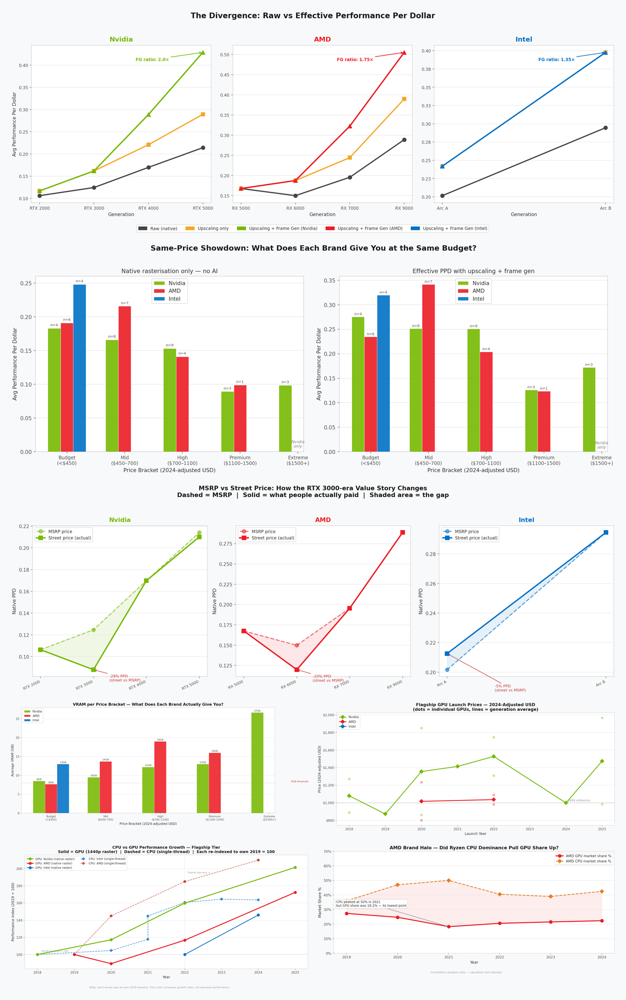
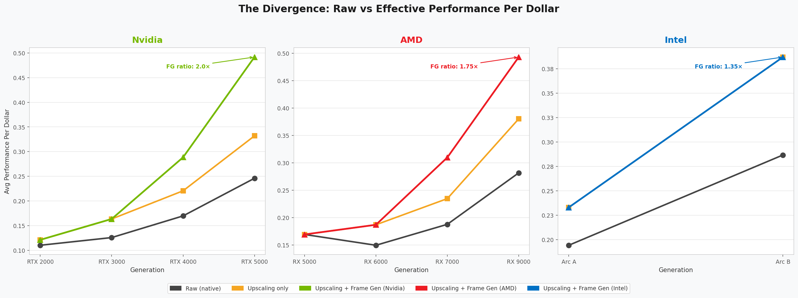
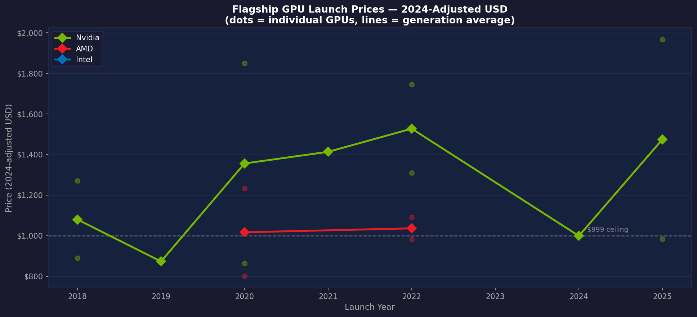
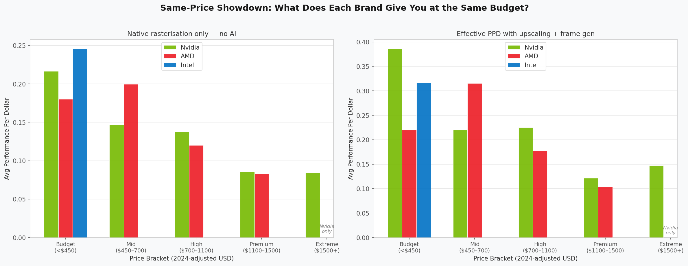
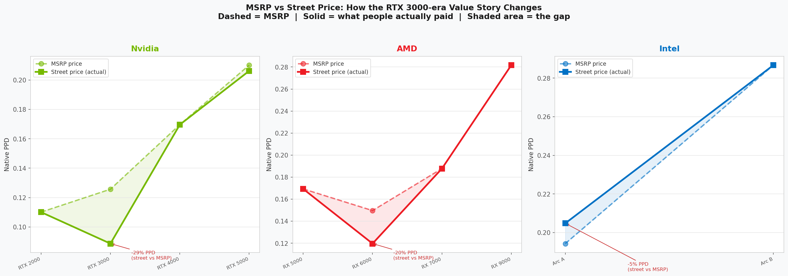
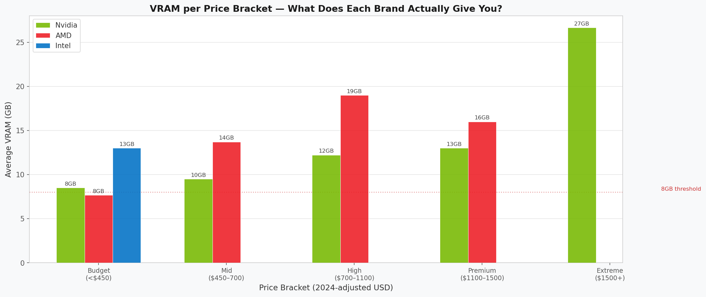
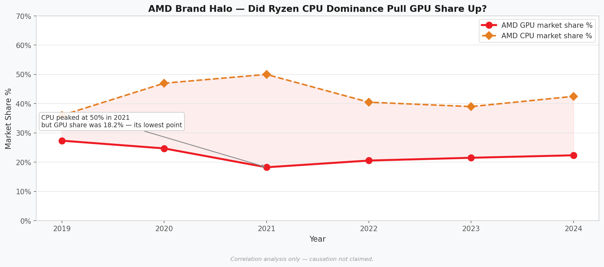

# The Upscaling Illusion
### Separating silicon progress from software illusion, 2018–2025

> An end to end data analysis project examining whether DLSS, FSR, and XeSS genuinely delivered better value per dollar across GPU generations, or whether manufacturers used AI upscaling as cover for slow raw hardware progress while raising prices.

---

## Proposed Question:

GPU manufacturers have spent the last three generations marketing AI upscaling as a revolution. DLSS 3, FSR 3, and XeSS all promise dramatically better performance with no extra silicon.

But strip out the AI-generated frames and ask what the hardware itself delivers: **Has real Performance Per Dollar (PPD which is measured as how much gaming performance you get per dollar spent) improved, stagnated, or declined?**

This project investigates four angles:

1. **The core divergence** - How much of the generational PPD improvement across Nvidia RTX 2000–5000, AMD RX 5000–9000, and Intel Arc A–B is raw silicon progress vs AI-assisted frame injection?
2. **CPU vs GPU trajectory** - Did GPU raw performance growth get slower relative to CPUs over the same period, quietly pushing the industry toward AI workarounds instead of better hardware?
3. **AMD brand halo** - When AMD dominated the CPU market with Ryzen (2020–2025), did that translate into GPU market share gains? Or did Nvidia's AI ecosystem hold the line regardless?
4. **Same-price value** - At the same budget, which brand delivers more raw performance per dollar? Flagship-vs-flagship comparisons are useful but incomplete: AMD's most expensive GPU costs roughly half of Nvidia's most expensive GPU. Price bracket analysis asks the fairer question.

---

## Interactive Dashboard

[](https://lalitsh03.github.io/upscaling-illusion/dashboard/dashboard.html)

*Click the image to open the live interactive version*

---

## Key Findings

### The divergence is real but it is mostly frame generation

Raw (native) rasterization PPD roughly doubled but it took 7 years to get there:

| Vendor | First Gen | Latest Gen | Native PPD Change |
|--------|-----------|-----------|-------------------|
| Nvidia | RTX 2000 (2018) | RTX 5000 (2025) | ~2× |
| AMD | RX 5000 (2019) | RX 9000 (2025) | ~1.5× |
| Intel | Arc A (2022) | Arc B (2024) | ~1.4× |

Effective PPD with upscaling and frame generation tells a very different story:

- **Nvidia RTX 5000 with Multi Frame Gen reaches ~4× the effective PPD of the RTX 2000 baseline** (native, no upscaling) - roughly 2× comes from 7 years of silicon progress, and the remaining ~2× comes from AI-generated frames, not rendered pixels
- Before frame generation existed (pre-2022), the upscaling boost was only 1.1–1.3× which is a modest quality improvement.



### Nvidia flagship prices rose 46% in inflation-adjusted dollars

"Real terms" means prices adjusted for inflation so a 2018 GPU priced at $700 is converted to what that $700 would be worth in 2024 dollars, making fair comparisons across years possible. In Nvidia's case, even after adjusting for inflation, flagship prices still went up significantly:

| Generation | Avg Flagship MSRP (2024 USD) | Change |
|-----------|-------------------------------|--------|
| RTX 2000 (2018) | $1,011 | baseline |
| RTX 3000 (2020) | $1,375 | +36% |
| RTX 4000 (2022) | $1,351 | −2% |
| RTX 5000 (2025) | $1,475 | +9% |

*(Flagship tier only: RTX 2080/Ti → RTX 3080/Ti/3090 → RTX 4080/Super/4090 → RTX 5080/5090. 2024-adjusted using US CPI.)*

So while raw performance roughly doubled, you are paying ~1.5× more in real purchasing power to get there at the flagship level. AMD's story is different: Their flagship MSRP was essentially flat between the RX 6000 (avg $1,017 in 2024 USD) and RX 7000 (avg $1,036) generations, and with the RX 9000 AMD chose not to release a flagship-tier card at all - the RX 9070 XT at $599 is their current best, sitting in the high tier rather than the >$1,000 bracket Nvidia occupies alone.



### Flagship vs flagship tells part of the story whereas same-price tells the rest

The flagship price trend above compares each brand's best product over time and is useful for tracking how the top-end market has moved. But it has a limit: AMD's highest-tier current card, the RX 9070 XT, launched at $599 while Nvidia's flagship RTX 5090 launched at $1,999. These are not the same product competing for the same buyer.

Comparing within price brackets gives the fairer picture i.e. what does each brand actually offer a buyer with a fixed budget:

| Price bracket | Native PPD winner | Effective PPD winner (with FG) | Notes |
|--------------|------------------|-------------------------------|-------|
| Budget (<$450) | **Intel** | **Intel** | Strongest raw silicon value; smaller upscaling ecosystem limits FG gains |
| Mid ($450–700) | **AMD** | **AMD** | Consistently better native PPD than Nvidia at the same price point |
| High ($700–1100) | **AMD** | **Nvidia** | AMD leads on raw silicon; DLSS + Frame Gen swings effective PPD to Nvidia |
| Premium ($1100–1500) | **AMD** | **Nvidia** | Same pattern; Nvidia's software ecosystem closes the raw gap |
| Extreme ($1500+) | **Nvidia only** | **Nvidia only** | AMD does not field a product here which is itself a data point |

The Extreme bracket ($1500+) immediately makes the fairness problem visible: Nvidia occupies it alone. AMD choosing not to compete at that price point is a business decision, not a capability ceiling i think but it does mean headline flagship comparisons (RTX 5090 vs RX 9070 XT) are comparing products from entirely different market positions.

The pattern across brackets also connects directly back to the AI upscaling finding: at the budget and mid tier, where frame generation is less impactful and DLSS support in games is less critical, AMD and Intel deliver better raw value. At the high end, Nvidia's DLSS ecosystem advantage and frame generation maturity are strongest which helps justify the price premium in effective PPD terms even where raw silicon value does not.



### MSRP vs What people actually paid; 2020–2022 was the worst, but not the only case

Using MSRP (the official launch price) is standard but misleading for several generations. The RTX 3000 and RX 6000 series launched into a cryptocurrency mining boom and COVID supply chain collapse which is the most extreme market distortion in this dataset:

| GPU | MSRP | Avg street price | Premium |
|-----|------|-----------------|---------|
| RTX 3080 | $699 | ~$1,050 | +50% |
| RTX 3070 | $499 | ~$750 | +50% |
| RTX 3060 Ti | $399 | ~$600 | +50% |
| RX 6800 XT | $649 | ~$900 | +39% |
| RX 6700 XT | $479 | ~$600 | +25% |

The 2025 launch window was a milder version of the same dynamic, the demand exceeded supply at launch for both Nvidia and AMD's newest cards:

| GPU | MSRP | Avg street price | Premium |
|-----|------|-----------------|---------|
| RTX 5070 | $549 | ~$700 | +27% |
| RTX 5070 Ti | $749 | ~$900 | +20% |
| RTX 5080 | $999 | ~$1,150 | +15% |
| RTX 5090 | $1,999 | ~$2,299 | +15% |
| RX 9070 XT | $599 | ~$670 | +12% |
| RX 9070 | $549 | ~$620 | +13% |
| RTX 4090 | $1,599 | ~$1,750 | +9% |

For this (2025) launch, AI boom increased the street amount of the GPUs by a decent amount. But, not every launch ran above MSRP as RX 7600 was quickly discounted 7% below MSRP and Intel Arc A-series sold 5–6% below. This project uses actual street prices for any GPU where the deviation exceeded ~5%, documented in the seed CSV's `notes` column.

When native PPD is recalculated using real street prices, Nvidia's RTX 3000 generation looks significantly worse and the 2025 launches look meaningfully worse than their paper MSRP would suggest. AMD's RX 6000 was affected in 2020–2022 too, but less severely: RDNA 2 was less efficient for crypto mining than Ampere, so its premiums were smaller and short lived.



### VRAM - A critical dimension the PPD metric misses

VRAM capacity has become a decisive purchase factor at 1440p and above. Modern games with high-resolution texture packs routinely exceed 8GB at 1440p. The comparison that defines the current mid-range:

| GPU | MSRP | VRAM | Value verdict |
|-----|------|------|--------------|
| Arc B580 | $249 | 12GB | Best VRAM-per-dollar in the dataset; budget card with mid range memory |
| RTX 5060 Ti 8GB | $379 | 8GB | Nvidia's 2025 mid-range still ships with 8GB VRAM which is less than a $249 Intel card |
| RTX 5060 Ti | $429 | 16GB | 16GB finally available from Nvidia, but at $180 premium over Arc B580 |
| RX 7800 XT | $499 | 16GB | AMD's established mid-high; 16GB since 2023 |
| RX 9070 XT | $599 | 16GB | AMD's current-gen high-tier; 16GB at a competitive price |

The VRAM per price bracket analysis shows AMD and Intel consistently offering more VRAM at the mid and high tiers. At the extreme bracket ($1500+), Nvidia's RTX 5090 leads with 32GB. The 8GB cap on Nvidia's mid range persisted from the RTX 4060/4060 Ti into the RTX 5060 Ti 8GB which became the most widely criticised VRAM pattern in the dataset. Only the $429 16GB 5060 Ti variant addresses it, and it costs $180 more than the Arc B580 which already ships 12GB.



### AMD brand halo story is more complicated than it first appears

AMD CPU share peaked at ~50% in 2021 which was its strongest position in a decade. At that same moment, AMD GPU share hit its **lowest point (~18%)**. No immediate halo effect.

But the story does not end there. AMD GPU share recovered every single year after 2021:

| Year | AMD GPU Share | AMD CPU Share |
|------|--------------|--------------|
| 2019 | 27% | 36% |
| 2020 | 25% | 47% |
| 2021 | 18% *(lowest)* | 50% *(peak)* |
| 2022 | 21% | 41% |
| 2023 | 22% | 39% |
| 2024 | 22% | 43% |

Two explanations compete here. The first is that the post-2021 recovery is simply the RX 7000 series being genuinely competitive hardware and nothing more. The second is a **delayed brand halo**: by 2022 AMD's CPU dominance had been mainstream for two to three years, and the enthusiast narrative had shifted toward full AMD platform builds (Ryzen CPU + Radeon GPU) as a coherent value play. On that reading, the CPU mindshare didn't convert immediately because Nvidia's RTX 3000 DLSS advantage was too strong to overcome mid-cycle but by the time the next generation launched, enough buyers were already AMD-curious that the RX 7000 had an easier entry. The data cannot separate these effects. What it does show clearly is that **Nvidia's DLSS ecosystem created stickiness that pure brand sentiment could not break in the short term**, and that whatever drove the recovery, it took a full hardware cycle to materialise.

What the market share table also does not show is *why* AMD's CPU share rebounded from 39% in 2023 back to 43% in 2024 after a dip. Three factors are running together in that number and the data here cannot isolate them cleanly:

- **3D V-Cache (X3D)** - Ryzen 7800X3D and 9800X3D became the clear recommendation for gaming PC builds from 2023 onwards. Reviews consistently placed them ahead of Intel's best in gaming workloads by a meaningful margin, driven by the stacked cache architecture rather than raw IPC. For enthusiast and gaming focused buyers which is also the segment most likely to show up in Steam Hardware Survey data and JPR estimates, X3D made AMD the default choice in a way that Ryzen alone had not fully achieved.
- **Power efficiency** - AMD's Zen 4 and Zen 5 architectures deliver competitive performance at significantly lower TDP than Intel's 13th and 14th Gen, which became a liability for Intel when reports of degraded high-end Intel CPUs emerged in 2023-2024. Builders looking at thermals and long-term reliability shifted toward AMD platforms.
- **Intel's 13th/14th Gen instability issues** - A widely reported issue with Intel's top-end desktop CPUs running at voltages that caused permanent degradation affected builder confidence in that segment precisely when AMD's X3D line was at its most competitive. This is not reflected anywhere in benchmark data but is a real factor in purchase decisions during that period.

These three forces together and not just raw IPC growth alone, explains AMD's CPU share recovery and make the brand halo question more complicated than a simple correlation between CPU share and GPU share.



---

## Data & Process

### Where the data came from

There is no single clean dataset for this kind of analysis. Data was assembled from four separate sources and merged in Python:

| Dataset | Source | What it contains |
|---------|--------|-----------------|
| GPU specs & performance | Tom's Hardware GPU Hierarchy (primary) + Passmark G3D Mark (supplement for VRAM-constrained budget cards) + Hardware Unboxed generation reviews | Launch price, launch date, 1440p rasterization index, upscaling tech version |
| CPU benchmarks | PassMark single-thread trend + Anandtech flagship reviews | Single-thread perf index per generation, launch price |
| US CPI (inflation) | US Bureau of Labor Statistics - annual CPI index | Multiplier to convert any year's USD to 2024 USD |
| GPU & CPU market share | Jon Peddie Research quarterly estimates + Steam Hardware Survey composites | Nvidia/AMD/Intel GPU share %, AMD/Intel CPU share % by year |

All four sources were structured into seed CSVs stored in `data/raw/`.

### How it flows through the pipeline

```
data/raw/
  gpu_specs_seed.csv          ──┐
  cpu_benchmarks_seed.csv     ──┤
  cpi_annual.csv              ──┼──► notebooks/01_data_collection_and_cleaning.ipynb
  gpu_market_share.csv        ──┤        │
  amd_cpu_market_share.csv    ──┘        │
                                         ├──► data/gpu_analysis.db   (SQLite - all tables)
                                         └──► data/processed/        (clean CSVs + charts)
                                                    │
                                         ┌──────────┤
                                         │          │
                              notebooks/02_analysis.ipynb     sql/02_analysis_queries.sql
                              (Python charts + findings)      (9 queries - run in DBeaver)

```

### Step 1: Data cleaning and enrichment (Notebook 01)

The raw GPU data had launch prices in nominal dollars across different years. Two inflation-adjusted price columns are computed:

- `launch_price_2024_adj` - MSRP × CPI multiplier. Used for the flagship price trend chart (what manufacturers intended to charge).
- `street_price_2024_adj` - actual street price × CPI multiplier. Used for all PPD calculations (what a real buyer actually spent).

For most cards these are identical. Where they differ:

- **RTX 3000 / RX 6000** (2020–2022 shortage era): street was 20–50% above MSRP which is the most severe divergence in the dataset
- **RTX 5000 Jan–Feb 2025 launch cards** (5070, 5070 Ti, 5080): supply-constrained at launch, 15–27% above MSRP; the 5060-series (May–June 2025) was 4–7% above
- **RTX 5090**: street ~15% above MSRP; Founders Edition sold out instantly, AIBs commanded premiums
- **RTX 4090**: AIB cards launched at $1,799+; FE was unavailable at MSRP for months; street average ~9% above MSRP
- **RX 9070 / RX 9070 XT**: strong March 2025 demand against RTX 5070/5070 Ti and street ran 12–13% above MSRP in the first 4–6 weeks
- **RX 7600**: sold below MSRP - weak entry-level RDNA 3 demand, retailers discounted to $249 within weeks of the $269 launch
- **Intel Arc A-series**: sold 5–6% below MSRP due to weak initial demand; Intel partner subsidies to drive volume

Three derived performance columns were then calculated per GPU:

```python
# Effective performance with upscaling quality mode (no frame gen)
gpus['perf_score_effective_no_fg'] = (
    gpus['perf_score_native_1440p'] * gpus['upscaling_boost_no_fg']
)

# Effective performance with upscaling + frame generation
gpus['perf_score_effective_with_fg'] = (
    gpus['perf_score_native_1440p'] * gpus['upscaling_boost_with_fg']
)

# PPD variants - divided by street_price_2024_adj (what buyers actually paid)
gpus['perf_per_dollar_native']            = gpus['perf_score_native_1440p']         / gpus['street_price_2024_adj']
gpus['perf_per_dollar_effective_no_fg']   = gpus['perf_score_effective_no_fg']       / gpus['street_price_2024_adj']
gpus['perf_per_dollar_effective_with_fg'] = gpus['perf_score_effective_with_fg']     / gpus['street_price_2024_adj']
```

The upscaling boost multipliers (e.g. DLSS 3.x with frame gen = 1.70×) were researched and assigned per GPU based on what technology was available at launch. Frame generation was deliberately kept separate from upscaling-only gains so the two contributions could be visually split in the analysis.

All tables were then written to a SQLite database (`data/gpu_analysis.db`) using `pandas.to_sql()`, making every table queryable directly in DBeaver without any further setup.

### Step 2: Analysis and visualisation (Notebook 02)

With clean data in the database, the analysis notebook connected to SQLite, pulled each table into a Pandas DataFrame, and built the four charts above. The CPU vs GPU trajectory chart required re-indexing both series to their own 2019 = 100 baseline so growth rates were comparable across different benchmark scales.

### Step 3: SQL queries (DBeaver)

Nine standalone queries in `sql/02_analysis_queries.sql` cover every angle of the project ranging from the headline divergence table to a value efficiency score that rates each GPU against its generation average. These were written to be run directly in DBeaver against `data/gpu_analysis.db` with no additional setup.

Open `data/gpu_analysis.db` in DBeaver and run any query from `sql/02_analysis_queries.sql` directly.

---

## Project Structure

```
.
├── data/
│   ├── raw/                   # Source CSVs: GPU specs, CPU benchmarks, CPI, market share
│   ├── processed/             # Cleaned data, exported charts (PNG)
│   └── powerbi/               # Reshaped CSVs for Power BI (5 view tables)
│       ├── v1_divergence.csv
│       ├── v2_price_trend.csv
│       ├── v3_framegen_breakdown.csv
│       ├── v4_cpu_gpu_trajectory.csv
│       └── v5_brand_halo.csv
├── notebooks/
│   ├── 01_data_collection_and_cleaning.ipynb  # Load, validate, inflation-adjust, export to SQLite
│   └── 02_analysis.ipynb                      # Full analysis: divergence, price, CPU/GPU, brand halo
├── sql/
│   ├── 01_schema.sql              # SQLite schema documentation
│   └── 02_analysis_queries.sql   # 9 analysis queries - DBeaver-ready
└── dashboard/
    └── dashboard.html             # Standalone interactive dashboard (open in any browser)
```

---

## Methodology

### Benchmark Scores: What They Are and Why We Used Them

**GPU - 1440p rasterization index (Tom's Hardware + Passmark G3D Mark)**

Every GPU in the dataset has a `perf_score_native_1440p` which is a relative performance index anchored to the RTX 3080 at launch = 100. A score of 150 means that GPU is approximately 50% faster than an RTX 3080 at 1440p rasterization. A score of 70 means 30% slower.

The index is built primarily from Tom's Hardware GPU Hierarchy, which averages 1440p framerates across a standardised game suite covering multiple engines and genres. Using a composite average rather than a single game is important because a GPU that excels in one engine but underperforms in another produces a misleading single-game result. The composite average smooths this out.

**Passmark G3D Mark as a supplement** - For budget GPUs with 8 GB VRAM (e.g. RX 7600, RTX 4060), Tom's Hardware's Ultra quality preset causes VRAM spills that depress scores below what a typical gamer at 1440p High/Medium would experience. For these specific cards, Passmark G3D Mark (a crowdsourced benchmark database with over 100,000 submissions per card) was used instead, since it reflects a broader range of real-world settings. The two sources are reconciled to the same RTX 3080 = 100 scale using an RTX 4070 anchor point (a 12 GB card where both sources agree closely).

**Why 1440p specifically?** At 1080p, the CPU starts to bottleneck many GPUs in the dataset, meaning the score reflects the test rig's processor as much as the GPU itself. At 4K, even high-end GPUs become VRAM and bandwidth-limited in ways that change the ranking order. 1440p is the resolution range where GPU-to-GPU differences are most clearly visible and where most of this dataset's target market actually plays.

**VRAM and why it matters at 1440p** - VRAM capacity does not appear in the `perf_score_native_1440p` index directly, but it increasingly affects real-world usability at 1440p and above. Modern games with high-resolution texture packs (Hogwarts Legacy, Alan Wake 2, Cyberpunk 2077 with RT Ultra) routinely exceed 8GB at 1440p with high settings, causing stutters and frame drops that do not show up in standardised benchmark runs which often use lower texture presets. The practical threshold: 8GB is workable at 1440p medium-to-high settings today but is becoming tight; 12GB is comfortable for current titles; 16GB is considered future-proof through the current generation. This is why the VRAM-per-price-bracket analysis in this project is treated as a separate dimension alongside PPD rather than folded into a single number as a GPU that scores well on raw PPD but ships with 8GB is not the same product as one with the same PPD score and 16GB.

**CPU - PassMark single-thread score**

CPU performance uses PassMark's single-thread performance index. This measures how fast one CPU core can execute a standardised sequence of operations like integer maths, floating point, encryption, compression.

**Why single-thread?** Gaming performance is primarily limited by single-thread CPU speed, not core count. A 16-core CPU with slow cores will often underperform a 6-core CPU with fast cores in games because the game engine's main thread is the bottleneck. Multi-thread scores would be more relevant for rendering or encoding workloads, not gaming.

---

### Cross-Brand Price-Tier Comparison

The flagship-filtered price trend chart tracks how the top of each vendor's range has moved over time. But flagship comparisons alone miss the more common question: **What does the same budget actually get you from each brand?**

The dataset covers three tiers; flagship, mid, and budget; across all three vendors. The pattern that holds across tiers:

| Price bracket | Native PPD winner | Notes |
|--------------|------------------|-------|
| Budget (~$150–250) | **Intel Arc** | Strongest raw performance per dollar; smaller ecosystem, fewer upscaling features |
| Mid-range (~$300–500) | **AMD** | Consistently better native PPD than Nvidia at equivalent prices; FSR works on any GPU |
| Flagship (~$700+) | **Nvidia** (effective PPD) / **AMD** (native PPD) | Nvidia leads once DLSS + Frame Gen is counted; AMD leads on raw rasterisation value |

The key nuance: Nvidia's ecosystem advantage (DLSS quality, frame generation maturity, wider game support) makes effective PPD comparisons move in Nvidia's favour at the high end, even when AMD's native silicon delivers more raw performance per dollar. At the mid and budget end where frame generation is less impactful, AMD and Intel represent better raw value.

---

### Performance Per Dollar (PPD)

The core metric. For each GPU:

```
PPD (native)  = perf_score_native_1440p  / street_price_2024_adj
PPD (no FG)   = perf_score_native × upscaling_boost_no_fg   / street_price_2024_adj
PPD (with FG) = perf_score_native × upscaling_boost_with_fg / street_price_2024_adj
```

`street_price_2024_adj` is used because it reflects what a buyer actually spent. For shortage-era cards (RTX 3000, RX 6000) this is materially higher than MSRP - which correctly makes those cards look like poorer value, because they were. The flagship launch price chart (fig 2) still uses `launch_price_2024_adj` since that chart tracks the manufacturer's pricing decisions, not secondary market conditions.

`perf_score_native_1440p` is a 1440p rasterization index relative to the RTX 3080 at launch = 100. Upscaling boost multipliers reflect quality-mode upscaling and frame generation gains per technology version:

| Technology | Upscaling only | With Frame Gen |
|-----------|---------------|---------------|
| DLSS 2.x | 1.30× | 1.30× (no FG on RTX 3000) |
| DLSS 3.x | 1.30× | 1.70× |
| DLSS 4.x (MFG) | 1.35× | 2.00× |
| FSR 2.x | 1.25× | 1.25× (no FG on RX 6000) |
| FSR 3.x | 1.25× | 1.65× |
| FSR 4.x | 1.35× | 1.75× |
| XeSS 1.x | 1.20× | 1.20× |
| XeSS 2.x | 1.35× | 1.35× |

*Sources: multiplier values are based on published frame generation and upscaling benchmarks (primarily Digital Foundry and Hardware Unboxed, 2022–2025). These figures are representative mid-range estimates at quality mode - per-game variance of ±10–15% is expected and individual titles may sit outside this range.*

Frame generation is tracked separately (`fg_inflation_factor`) because it generates interpolated frames rather than rendering them which is inflating FPS without improving input latency.

### Inflation Adjustment

All launch prices converted to **2024 USD** using US Bureau of Labor Statistics CPI annual multipliers, making a 2018 $499 GPU directly comparable to a 2025 $599 GPU.

### CPU vs GPU Trajectory - Re-indexing to 2019 = 100

CPU and GPU benchmarks are measured in completely different units - a GPU rasterization score of 150 and a CPU single-thread score of 3200 have no meaningful relationship to each other. Plotting them on the same axis raw would produce a chart that shows size, not growth.

Re-indexing solves this. For each series, the 2019 value is set to **100**. Every other year is then expressed as a percentage of that starting point. A value of 160 in 2023 means that metric grew 60% since 2019. A value of 130 means 30% growth. Now every line starts at the same point and the chart shows **growth rate only** which is the actual question being asked.

The word "own" matters: each line uses *its own* 2019 value as the base independently. Nvidia's GPU line and Intel's CPU line both start at 100 in 2019, but 100 means something different for each of them. This is intentional as it removes any cross-series magnitude comparison and leaves only the trajectory.

### Generation Averaging

Individual GPUs within the same generation (e.g. RTX 4070, 4070 Ti, 4080, 4090) have very different price and performance points. Plotting every GPU individually would make generational trends unreadable and would skew results toward whichever tier happened to have more SKUs.

For the divergence and price trend analysis, all GPUs within a generation are **averaged into a single generation-level data point**. This means the RTX 4000 series is represented by one number which is the mean PPD and mean price across all RTX 4000 GPUs in the dataset rather than four separate points pulling the line in different directions. The individual GPU dots are still shown behind the line in the price chart so the spread is visible.

### Flagship-Only Filtering (Price Chart)

The price trend chart is filtered to **flagship-tier GPUs only** (RTX 4090, RX 7900 XTX, Arc A770, etc.). The reason is that comparing a budget GPU from 2018 to a flagship from 2025 would tell you about product mix changes, not about whether the top-end market has gotten more expensive. Filtering to flagship ensures the comparison is like-for-like, the best each vendor offered at each point in time.

---

## How to Reproduce

**Requirements:** Python 3.10+

```bash
# 1. Clone
git clone https://github.com/Lalitsh03/upscaling-illusion.git
cd upscaling-illusion

# 2. Install dependencies
pip install pandas numpy matplotlib seaborn plotly nbformat jupyter

# 3. Run the notebooks in order
jupyter notebook notebooks/01_data_collection_and_cleaning.ipynb
jupyter notebook notebooks/02_analysis.ipynb

# 4. Regenerate the interactive HTML dashboard
python dashboard/build_dashboard.py
# Output: dashboard/dashboard.html - open in any browser
```

**SQL:** Open `data/gpu_analysis.db` in DBeaver, then run any query from `sql/02_analysis_queries.sql`.

---

## Limitations

### Benchmark sourcing: primary + targeted supplement

GPU performance data comes from two sources: Tom's Hardware GPU Hierarchy (primary) and Passmark G3D Mark (supplement for 8 GB VRAM-constrained budget cards). This was a deliberate two-source approach, not an inconsistency.

GPU benchmarks are notoriously difficult to combine across sources. A score from 3DMark or a reviewer's custom test suite depends heavily on the specific test rig - CPU, RAM speed, storage, driver version, game mix and resolution. Mixing sources freely would introduce systematic discrepancies that look like real performance differences but are not.

Tom's Hardware Ultra preset is the right primary source for mid-range and high-end cards, where it reveals real performance differences. But for 8 GB VRAM cards at 1440p Ultra, the preset triggers VRAM spills that produce misleadingly low scores - scores that reflect VRAM headroom, not GPU performance. Passmark G3D Mark, with its large submission pool across varied real-world settings, is more representative for those specific cards. Both sources are reconciled to the same RTX 3080 = 100 scale. The trade-off is that a small number of relative values carry more uncertainty than the majority, and this is noted in the seed CSV where it applies.

### Other constraints

- **Upscaling multipliers are generation averages** - per-game variance for DLSS/FSR/XeSS can swing 15–25% depending on the title, so individual game results will differ from the averages used here
- **Street prices are used whenever the deviation from MSRP was material and here's how that was determined** - a card is treated as "at MSRP" if its real market price settled within ~5% of list price within 4–6 weeks of launch; that 5% swing affects all vendors equally and does not change the direction of any finding. Where deviations were larger or more sustained, actual street prices are used instead. The methodology was applied consistently across every GPU in the dataset after individual review: the RTX 3000 / RX 6000 shortage era (20–50% premiums, sustained 12–18 months) is the most extreme case, but the RTX 5000 Jan 2025 launch cards (15–27% above MSRP), RTX 4090 (AIB premiums averaging ~9%), and RX 9070/9070 XT (12–13% above MSRP at launch) were all material enough to use street prices. Conversely, the RX 7600 and Intel Arc A-series sold *below* MSRP and are adjusted downward. Every deviation is documented in the `notes` column of `gpu_specs_seed.csv`. The shortage era remains categorically different in scale as a 40–50% premium sustained over a year changes which generation looks like good value, and it does so asymmetrically (Nvidia's Ampere was the more popular mining card, so it suffered a larger and longer premium than AMD's RDNA 2)
- **FSR 4.1 is under-represented** - AMD's upscaling has improved significantly with FSR 4.1 (released for the RX 9000 / RDNA 4 series). Early head-to-head tests show it closing the gap with DLSS 4 meaningfully, but stable cross-game benchmark data was not yet available at the time of analysis.
- **Frame generation and input latency** - the FPS numbers frame generation produces are real, but they come with added input latency that is not captured in any performance index. A competitive or latency-sensitive player may find frame-generated FPS less useful than native FPS at the same number
- **Market share estimates are approximate** - figures sourced from Jon Peddie Research quarterly estimates and Steam Hardware Survey composites; useful for trend direction, not precise percentages
- **Correlation ≠ causation** - especially in the brand halo section. The chart shows what happened to AMD GPU share as CPU share moved; it does not prove any causal mechanism

### The laptop gap - a real limitation and a future direction

AI upscaling arguably delivers its strongest value proposition on laptops, where thermal and power constraints mean native rasterisation performance is most limited. A mid-range laptop GPU running DLSS at quality mode can feel significantly faster than its native framerate suggests.

This project has no laptop data. The reason is the same as above, but compounded: laptop GPU benchmarks are fragmented across thousands of configurations say different TDP limits for the same GPU SKU, regional variants, different display resolutions (from 1080p to 2.8K OLED), different RAM configurations, and different cooling setups. A benchmark for an RTX 4060 Laptop GPU in one review is often measuring a different thermal envelope than the same GPU in another review. Combining these into a meaningful PPD metric would require controlling for variables that most reviews do not publish.

This is not a reason to ignore the laptop market rather it is a reason why a dedicated laptop GPU analysis would need to be scoped very differently, probably anchored to a single OEM line or a single reviewer who has tested consistently across configurations.

---

## Potential Future Extensions

| Extension | Why it matters |
|-----------|---------------|
| **Laptop GPU analysis** | AI upscaling has the biggest real-world impact on power-constrained mobile GPUs - but requires a controlled single-source dataset scoped to consistent configurations |
| **Per-game upscaling variance** | The generation-average multipliers used here hide significant title-to-title variance in DLSS/FSR/XeSS quality; a game-level breakdown would be more precise |
| **Input latency dimension** | Frame generation inflates FPS but increases input latency - adding a latency-adjusted PPD metric would give a more complete picture for competitive players |
| **RTX 5000 / RX 9000 live data** | The latest generation data in this project is based on launch benchmarks; updating with post-launch driver-optimised numbers over time would test whether the FG ratio holds |
| **FSR 4.1 head-to-head analysis** | FSR 4.1 (March 2026) is being called a genuine DLSS competitor by reviewers - a dedicated comparison once stable multi-game benchmark data is available would update the effective PPD picture for AMD considerably; FSR 4 (included here) was the starting point, FSR 4.1 appears to be where it gets truly competitive |
| **VRAM performance impact (per-game)** | VRAM capacity by generation and price bracket is now included in this project. What is not yet captured is the *performance impact* of VRAM limits - how many frames per second are lost when a game exceeds the card's VRAM budget, and which specific titles trigger those limits at 1440p. That requires game-level VRAM headroom data, which varies title by title and is not captured in composite benchmark indexes |
| **Regional pricing** | GPU prices vary significantly by market; extending the inflation adjustment to non-USD markets (EU, India, SEA) would make the value analysis globally relevant |

---

## Tools

| Layer | Tools |
|-------|-------|
| Data wrangling | Python 3.13, Pandas, NumPy |
| Database | SQLite, DBeaver |
| Analysis & charts | Matplotlib, Seaborn, Plotly |
| Dashboard | Plotly - `dashboard/dashboard.html` (open in any browser) |
| Version control | Git, GitHub |

---

## Conclusion

AI upscaling is real technology that genuinely improved what consumers could do with a given GPU. But the way it is marketed conflates two very different things: better rendering and AI-generated frames and the data shows the industry has leaned harder on the second as the first got harder to deliver.

Raw GPU performance roughly doubled over 7 years across all three vendors. That sounds significant until you realise Nvidia's flagship prices also went up ~1.5× in that same window in real purchasing-power terms. AMD delivered better raw value, their native PPD improved ~1.5× while their flagship MSRP stayed flat in real terms, and AMD chose not to compete in the >$1,000 bracket at all with the RX 9000 generation. Note that real buyers paid 12–13% above MSRP for RX 9070/9070 XT at launch, compressing the street-price PPD gain somewhat. Intel Arc came in as the strongest value play per raw dollar, though with the smallest ecosystem.

The frame generation story is the most important finding. Before 2022, upscaling added a modest 1.1–1.3× boost. After 2022, frame generation pushed the effective multiplier to 1.65–2.0×, which is what drives the impressive generational comparison numbers manufacturers put in their marketing. Strip it out, and the hardware improvements are there but unspectacular.

The AMD brand halo question has no clean answer. CPU dominance did not translate to immediate GPU share gains but the opposite happened. AMD's GPU recovery from 2022 onwards leaves open whether the groundwork laid during the Ryzen era contributed later, alongside competitive hardware. The data alone cannot resolve that.

One thing the data does not fully capture is how fast AMD's upscaling has improved. FSR 1 and 2 were widely criticised for image quality. FSR 3 closed the gap noticeably. FSR 4, released with RDNA 4, brings a neural model (running on the dedicated AI accelerators on RX 9000 GPUs) that early testing puts genuinely close to DLSS in image quality. And FSR 4.1 put it on the equal footing with DLSS 4.0, only lagging behind DLSS 4.5. Stable cross-game data was not available to quantify this properly, so the multipliers in this analysis are conservative for AMD's newest generation. If that trajectory holds, the effective PPD gap between AMD and Nvidia at the high end could narrow more than this dataset currently shows.

The overall picture: The technology is delivering more performance per dollar, but the gains are increasingly coming from software and AI rather than from the silicon itself and prices have moved upward to capture much of that value back from the consumer.

---
